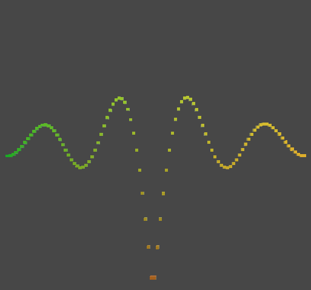

# Unity Mathematical Surfaces Project

This Unity project uses game objects to display multiple and complex functions based on the tutorial [Mathematical Surfaces](https://catlikecoding.com/unity/tutorials/basics/mathematical-surfaces/) by [Jasper Flick](https://catlikecoding.com/).

## Overview

The purpose of this project is to demonstrate the visualization of various mathematical functions in Unity using game objects. The tutorial by Jasper Flick guides you through creating a function library, managing methods with a delegate and an enumeration type, and displaying both 2D and 3D functions.

## Tutorial Source

- Tutorial: [Mathematical Surfaces](https://catlikecoding.com/unity/tutorials/basics/mathematical-surfaces/)
- Author: [Jasper Flick](https://catlikecoding.com/)

## Milestones Checklist

- [x] **Function Library:** Create a function library for managing mathematical functions.

    

    
</p

- [ ] **2D Functions:** Display 2D functions on a grid for visualization.
- [ ] **3D Functions:** Define and visualize surfaces in 3D space using mathematical functions.

## Getting Started

To begin working with this project, follow these steps:

1. Clone or download the repository to your local machine.
2. Open the project in Unity.
3. Add the `SampleScene` to the Hierarchy.

## License

This project is licensed under the MIT License - see the LICENSE file for details.

## Acknowledgments

[Jasper Flick](https://catlikecoding.com/) for the excellent Unity tutorial.

